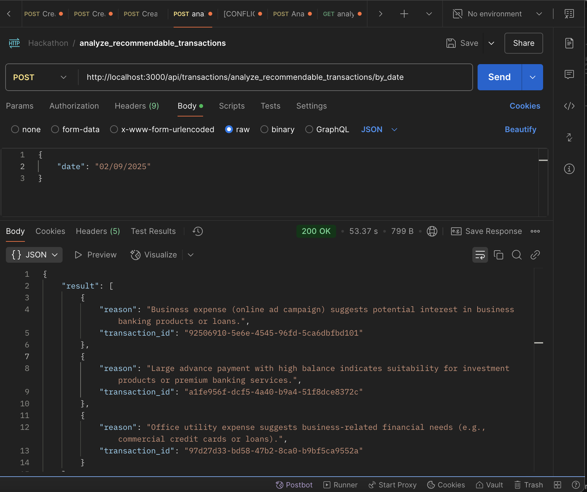
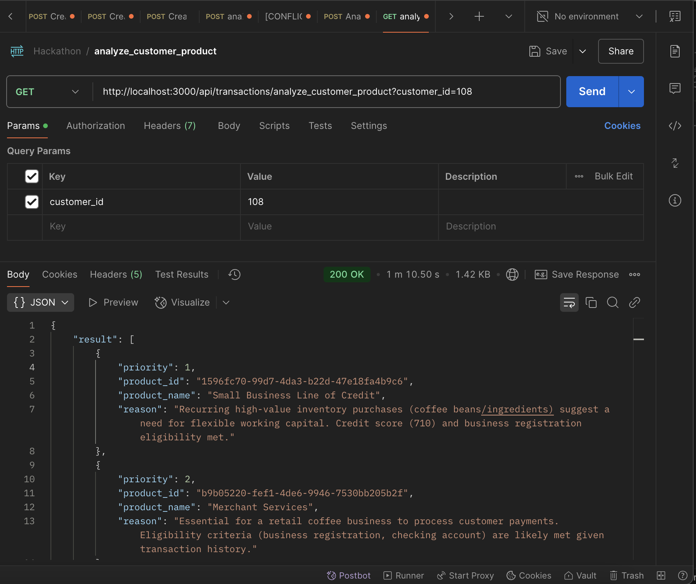
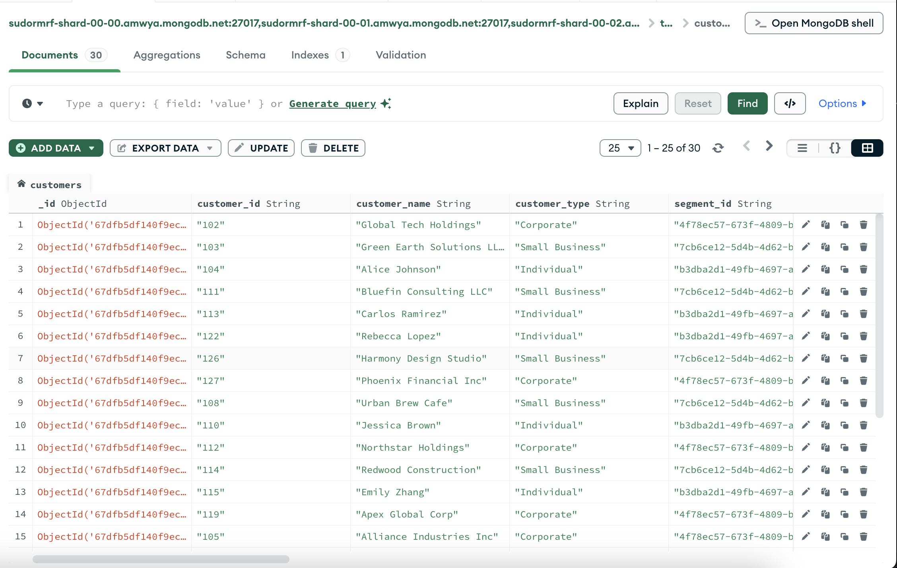
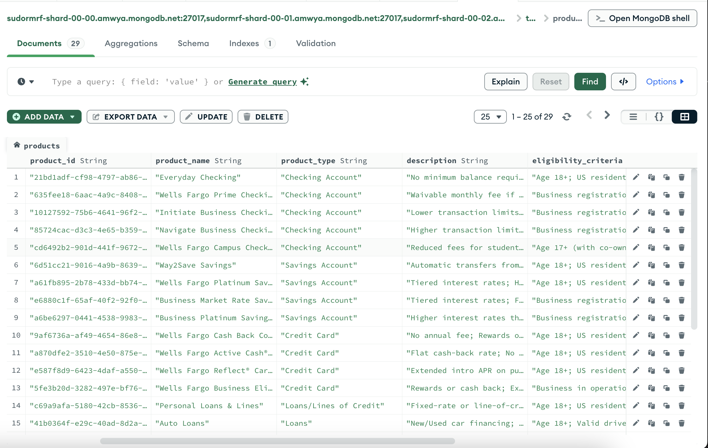
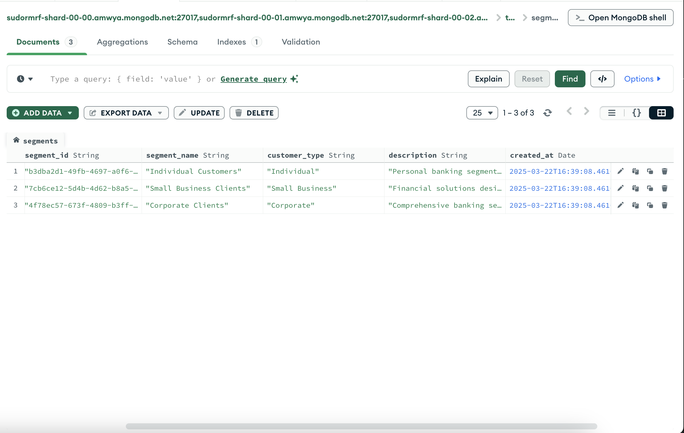
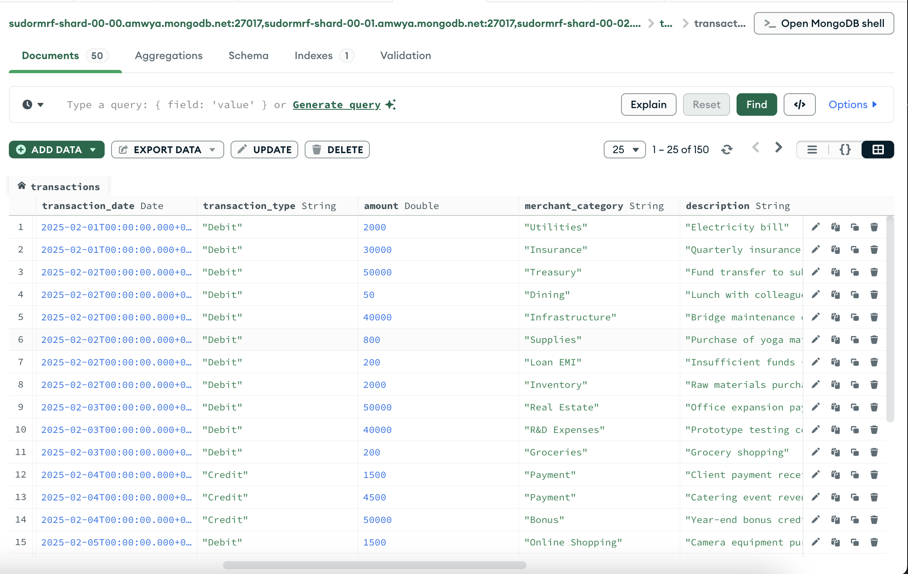

# 🚀 AI Driven Hyper Personalization

## 📌 Table of Contents

- [Introduction](#-introduction)
- [Demo](#-demo)
- [Inspiration](#-inspiration)
- [What It Does](#️-what-it-does)
- [How We Built It](#️-how-we-built-it)
- [Challenges We Faced](#-challenges-we-faced)
- [How to Run](#-how-to-run)
- [Tech Stack](#️-tech-stack)
- [Team](#-team)

---

## 🎯 Introduction

Our project aims to recommend products to customers—whether individuals or organizations—based on their data. By leveraging recent transaction trends, customer profiles, and advanced AI capabilities, we deliver personalized product suggestions that adapt dynamically to changes in customer behavior.

## 🎥 Demo

📹 Youtube Demo video link: [https://youtu.be/KEoaGlllDEI](https://youtu.be/KEoaGlllDEI)

🖼️ Screenshots:








## 💡 Inspiration

Banks need to suggest the most suitable products for each customer. Currently, these suggestions are dynamic, time-sensitive, and largely human-driven. Our solution automates this process by analyzing recent transactions and customer behavior, delivering product recommendations that are timely and relevant.

## ⚙️ What It Does

- **Dynamic Recommendations:** Incorporates recent changes in customer behavior to suggest the most relevant products.
- **Data-Driven Insights:** Analyzes transaction history, income, credit score, and interests to tailor product suggestions.
- **LLM Integration:** Uses AI-powered language models to generate and refine recommendations based on complex data patterns.

## 🛠️ How We Built It

Our solution is built with a focus on scalability and real-time data processing. Key components include:

- **API-Driven Architecture:** Two main APIs handle daily transaction validation and bi-weekly customer product analysis.
- **Database Integration:** Uses MongoDB to manage customer, product, and transaction data.
- **AI Integration:** Leverages OpenAI API (Deepseek R1) for generating recommendations.
- **Flask Framework:** The backend is developed using Python and Flask, ensuring a lightweight and robust service.

## 🚧 Challenges We Faced

- **Data Validation:** Ensuring transaction data integrity and handling anomalies.
- **Real-Time Processing:** Balancing real-time data ingestion with complex AI computations.
- **Integration:** Seamlessly connecting multiple systems including databases, schedulers, and external APIs.
- **Scalability:** Designing a system that can scale with increasing data volumes and user demands.

## 🏃 How to Run

### Envs required

```sh
MONGO_URI=<mongodb_atlas_uri>
DB_NAME=<database_name>
OPENAI_API_KEY=<openai_api_key>
OPENAI_BASE_URL=<openai_base_url>
```

1. Navigate to the code source directory:

   ```sh
   cd code/src
   ```

2. Install dependencies:

   ```sh
   pip3 install -r ./requirements.txt
   ```

3. Run the application:
   ```sh
   python3 -m main
   ```

## 🏗️ Tech Stack

🔹 Backend: Flask (Python)
🔹 Database: MongoDB
🔹 AI Integration: OpenAI API / Deepseek R1

## 👥 Team

Anirban Sikder  
Devtanu Misra  
Krishnendu Bera  
Narasimha M. Edala  
Dwaipayan Guha
